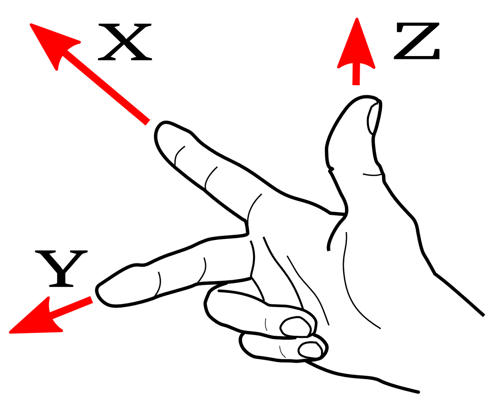

# RadarOSM


# 1. System enviroment:
Ubuntu 16.04


# 2. How to build the sytem
Using docker:
Use the dockerfile to build the container.
- to build the image, run "docker build . -t radarosm"
- to run the container, run "docker run -it -v /RadarOSM:/home/radarosm radarosm"

OR

In Ubuntu 16.04:
To build this you need (if not using the dockerfile):
 - Linux or OS X (or any other Unix-like OS)
 - A C++ compiler (g++/clang++/etc)
 - A recent version of Boost with the Boost.Python, Serialization and program_options modules.
 - CMake
 - Python 2.7 (Python 3 may or may not work)
 - Qt4
 - python packages specified in the file "Dockerfile"

Build Instructions (this is to build the osm_objects.so):
 - from src run:
    cmake .
    make
   ```


# 3. Download the datasets at:
Download the Navtech radar sequences described in our paper from [here](https://drive.google.com/drive/folders/11NB65HIwFoA286uVMTwplR_BBaan-l80?usp=sharing), unzip the data Oxford_Dataset.zip and Boreas_Rdar_dataset.zip in /data/radar/

# 4. How to run
To see how to run the code, please look at the shell scripts (files ending in .sh) in src.  To run the sequences used in the paper:

- the main executable file is map_localization.py which uses configuration files in src/configs.  The path to the data_dir may need to be updated in these files for your local configuration.
- the shell scripts e.g. oxford-01-10-11-46-21.sh should be referenced for how to run map_localization.py and reproduce the results in the paper.  


To run this on new sequences you will need to (at a minimum) to the following things:

- Download an OSM file for the corresponding region and convert it using osm_convert as .bin for route network (a la convert_data.sh)
- Provide the radar data as shown in data/radar/Boreas_Radar_Dataset/boreas-2021-11-02-11-16/radar_zfill_six/ 
  If you want to use radar data not from Navtech radar, you need to rewrite the function load_radar_pointcloud in RadarUtils.py and customize it for your radar data. For new sequences, load_radar_pointcloud will generate folders named "/normals" and "/pointcloud". 
- Compute radar odometry and output in the format described in data/odometry/README
- Create a .dcfg file indicating where the various pieces are (all the paths pointing to the sensor and the map data)


To visualize what's going on in each frame:
- Set the variable drawPosterior = True in RadarFiltering.py to visualize the posterior in each frame
- Set drawObservation = True in RadarFiltering.py to visualize the association between the radar feature points and the OSM map


# 5. Coordinate system


# 6. Citation
If you use Radar-SLAM in an academic work, please cite:
```bibtex
@inproceedings{hong2023large,
  title={Large-Scale Radar Localization using Online Public Maps},
  author={Hong, Ziyang and Petillot, Yvan and Zhang, Kaicheng and Xu, Shida and Wang, Sen},
  booktitle={2023 IEEE International Conference on Robotics and Automation (ICRA)},
  pages={3990--3996},
  year={2023},
  organization={IEEE}
}
```


# 7. Acknowledgement
Our code is based on "Lost! Leveraging the Crowd for Probabilistic Visual Self-Localization." Marcus A. Brubaker, Andreas Geiger and Raquel Urtasun. In Proceedings of IEEE CVPR 2013.


